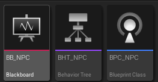
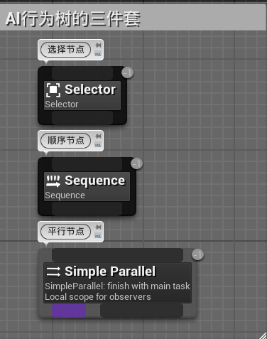
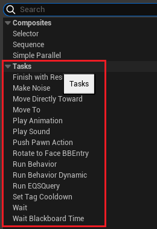
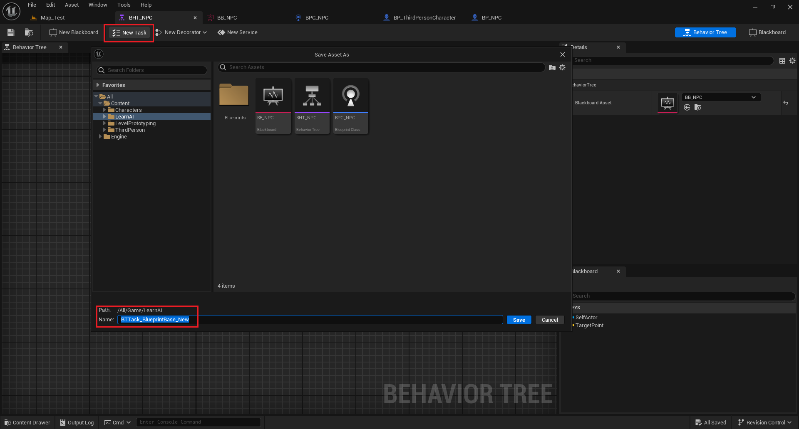
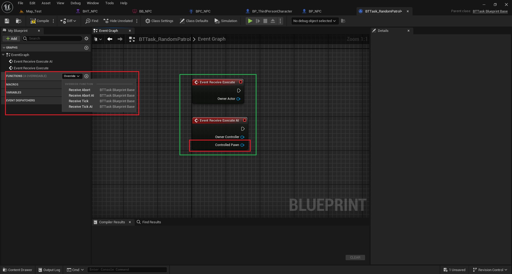
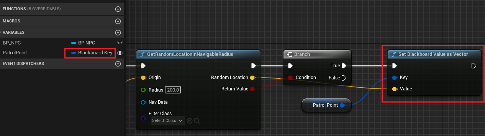
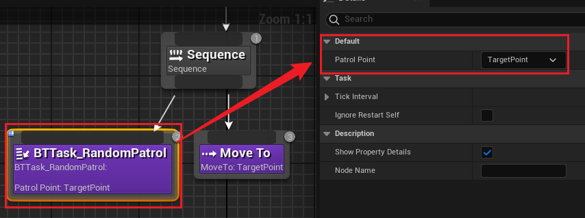
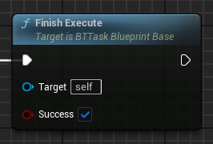
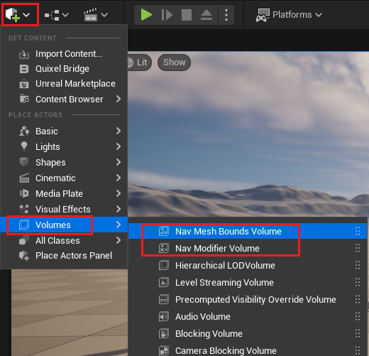
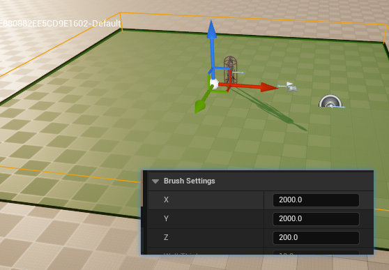

- 参考链接
	- [UE4 AI 行为树简记_event receive execute ai-CSDN 博客](https://blog.csdn.net/u012793104/article/details/76714383)
	- [虚幻引擎倾囊相授计划：AI 行为树系统教程（上）](https://www.bilibili.com/video/BV1dz4y1A7G3)

<!--more-->

# AI 模块基础三件套

- 黑板
- 行为树
- AI 控制器

## 行为树

### Composites

此类节点，决定行为树分支之间和分支中的执行逻辑

- *选择节点*：从左到右遍历节点，跳过不成功的节点，执行第一个成功的节点
- *顺序节点*：从左到右遍历节点，堵塞在不成功的节点，一直尝试执行，成功则执行下一个
- *平行节点*：左侧为当前执行，右侧为后台执行，比如下图中后台执行的为播放声音，并添加了一个装饰器用来冷却播放声音的时间间隔。该节点还可以设置两个平行节点执行的模式，immediate 为左侧执行完就停止执行，delayed 则会等待右侧的执行完毕再整体停止

### Tasks

Task 节点则决定具体执行的动作

也可以自行创建自定义 Task 节点，实现自定义逻辑

- EventReceiveExecute/EventReceiveExecuteAI
	- 两种节点区别在于带 AI 的可以接收当前的 Pawn，如果同时存在下边两个事件，*优先执行 EventReceiveExecuteAI*
	- 定义 Task 的主体逻辑代码，一般情况下都需要以*FinishExecute*结束
	- **FinishExecute**：向上层返回执行结果，无该节点会导致该 Task 不会执行完成，除非被打断
- EventReveiveAbort/EventReveiveAbortAI
	- 任务被打断时触发，*处理突发事件对当前行为的影响*
	- 两个事件同时存在也是同理，但一般情况下都需要以*FinishAbort*节点结束
	- **FinishAbort**：结束该节点执行

假如这里要实现一个随机巡逻，则需要 Task 获取每次巡逻的目标点，并将该点的位置信息传给行为树

注意上图几点：
- *创建的变量类型为黑板键选择器，Blackboard Key Selector，注意勾选为公开，暴露给行为树*
- *给黑板传递时，要使用 Set Blackboard Value as Vector 方式传递变量*

接下来就可以在行为树中使用该 Task 节点，并且可以在右侧细节面板内*将公开的变量和黑板中的变量一一对应起来*

最后不要忘了在 Task 中最后连接完成执行节点

## 黑板

## AI 控制器

---
# 导航网格

借助导航网格，实现 AI 的寻路功能

拖入到场景中，通过 Brush 设置导航体积大小（按 P 显示导航网格）

