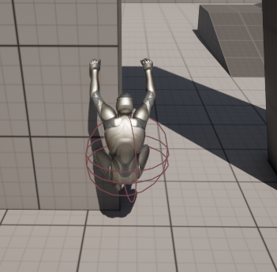

<!--more-->

# 攀爬系统开发文档

## 项目概述

- **目的**：开发一个自适应墙面的攀爬系统
- 将攀爬系统相关的功能封装为一个组件，保证系统的可复用性，和可拓展性


## 项目进度

- [x] <font color="#81C784">攀爬系统基础框架</font>
- [x] <font color="#81C784">四向攀爬动作，GroundIdle 和攀爬状态切换</font>
- [x] <font color="#81C784">边缘检测，攀爬至边缘登顶（Climb to top），边缘进入攀爬（Down to Climp）</font>
- [x] <font color="#81C784">ControlRig 调整动画的 RootMotion，以及手脚 IK 检测实现墙壁抓取自适应</font>
	- [ ] <font color=#E57373>未完成部分：</font>[特殊情况下的 IK 自适应](#攀爬时墙面角度突变位置) 
- [x] <font color="#81C784">MotionWarping 调整动画的 RootMotion，实现角色对适当高度障碍物进行 Vaulting 时的平滑移动，以及攀爬时的跳跃动作 HopUp 和 HopDown</font>
	- [ ] <font color=#E57373>未完成部分：</font>HopLeft 和 HopRight 动作
- [x] <font color="#81C784">分离地面运动输入上下文和攀爬输入上下文，实现动态切换键位映射</font>


## 关键技术

- 攀爬检测
	- 可攀爬墙壁检测
	- 边缘检测：攀爬登顶和边缘攀爬
- ControlRig
	- 调整动画 RootMotion
	- 手脚 IK 的墙面抓取自适应
- MotionWarping
	- 调整动画 RootMotion
	- 设置动画位置，检测运动目标点，实现 RootMotion 的匹配运动


## 优化部分


## 遗留问题

项目进行中遇到的一些问题

### 攀爬时墙面角度突变位置

- [ ] <font color="#E57373">情况一：</font>目前项目中的 IK 检测是攀爬状态中实时进行，从图可以看出，左右攀爬时另一侧手 IK 位置会抬高，从而导致检测到的位置平均到了墙壁上表面，结果就出现了图中情况
	- 
	- <font color= #64B5F6>思路：使用动画通知，在动画中手脚真正需要贴合墙壁时进行检测自适应</font>
- [ ] <font color="#E57373">情况二：</font>遇到墙面转向时，检测转向位置，让角色停在不会出现上图的情况的位置。如果玩家继续控制角色向转向位置移动，则直接播放蒙太奇，将角色从当前墙壁转到侧面的墙壁
	- 
	-  <font color= #64B5F6>思路：在动画过程中设置转向，并将角色重新吸附到侧边墙壁</font>


---

# 项目开发记录

因为要修改角色运动状态，这里直接继承`UCharacterMovementComponent`

> 选择这里继承有两个原因：
> 1. UCharacterMovementComponent 中已经实现了部分运动逻辑，不需要重新实现一遍
> 2. 父类中有 UNavMovementComponent，表明该组件也可以用于作为 AI 角色的移动组件，不需要担心适用性问题

## 定义新的 MovementMode

UE 内置了一些运动状态

```cpp
EMovementMode::MOVE_None;
EMovementMode::MOVE_Walking;
EMovementMode::MOVE_NavWalking;
EMovementMode::MOVE_Falling;
EMovementMode::MOVE_Swimming;
EMovementMode::MOVE_Flying;
EMovementMode::MOVE_Custom;
```

如果需要添加自定义的运动状态，需要在 `MOVE_Custom` 状态下进行扩展，比如本文将要新增一个攀爬状态

```cpp
UENUM(BlueprintType)
namespace ECustomMovementMode
{
	enum Type
	{
		MOVE_Climb UMETA(DisplayName = "Climb Mode)
	};
}
```

## 实现新的 MovementMode

实现一个 MovementMode 的步骤我总结为四步：
- 判断
- 进入
- 更新
- 退出

### 判断逻辑

判断能否进入新运动状态自然是需要重新实现的部分，本系统为攀爬系统，需要判断当前角色状态是否可以进入攀爬

为了方面开发和调试，这里将攀爬绑定为按键`F`触发


