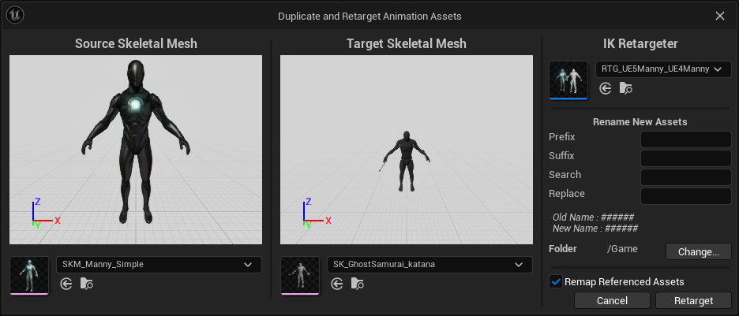

<!--more-->

## 动画重定向

### 外部 UE4 资源重定向时的问题

- 参考链接
    - [UE5 与 C++ 入门教程·第二课：动画重定向 | 小谷的编程随笔空间](https://gu.ink/2023/unreal-retargeting/index.html)
    - [调整 Lyra 动画并在自己的 UE5 游戏中使用 - Unreal Engine](https://www.unrealengine.com/zh-CN/tech-blog/adapting-lyra-animation-to-your-ue5-game)

项目中使用 *GhostSamurai_Bundle*，动画包中的资源为 UE 4 版本，这里要在 UE 5 中使用

直接将动画包导入了 UE 5 的项目中进行重定向，然后再转到目标骨骼上，

- 
- 

如果直接 424，播放动画时可能出现骨骼出现晃动
