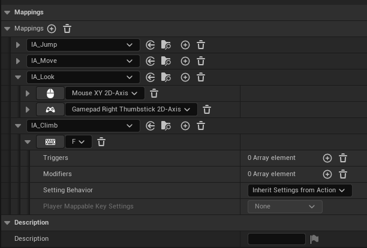

<!--more-->

相关头文件为：

要在构建文件中添加相关的模块

- [UE5 入门学习笔记（五）——增强输入（Enhanced Input）\_ue5 增强输入-CSDN 博客](https://blog.csdn.net/qq_45523399/article/details/133592212)

内部设置如下，和直接在项目设置中添加映射方式一样

只是这里将每一种映射封装成了一个类（？）

打开角色蓝图，可以直接在角色蓝图中设置这些键位映射

