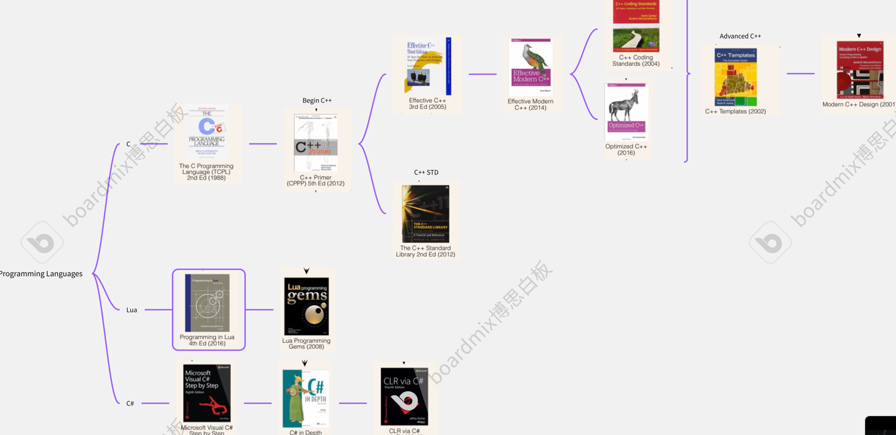
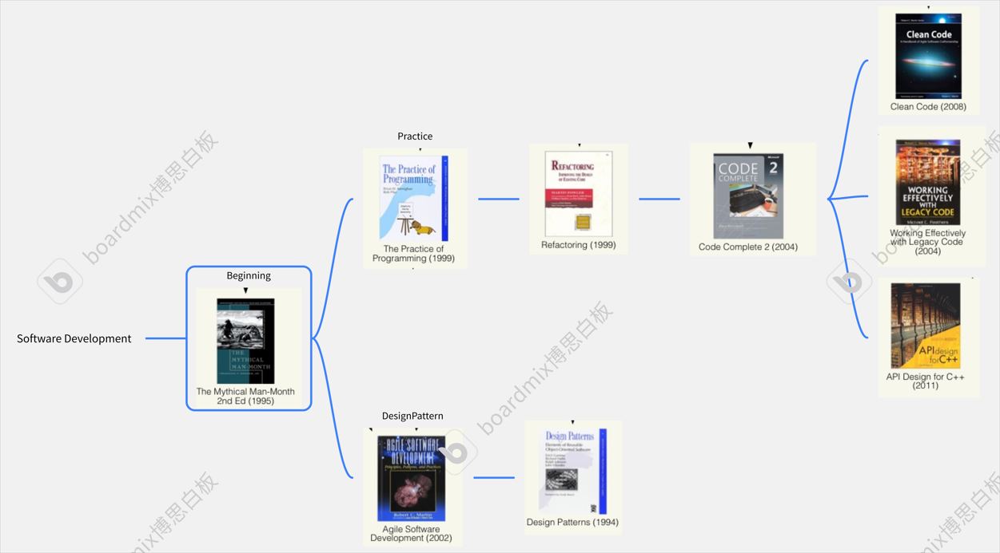
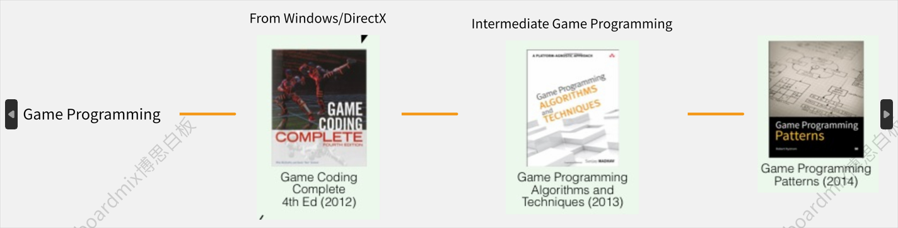
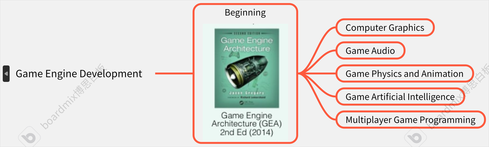

# Game Programmer

两个重要的时间节点: 
- **三年**: 每个模块都有接触, 知道是什么, 知道有什么, 熟悉一套模块的API, 确定感兴趣的模块, 开始深入
- **五年**: 兴趣模块钻研到比不研究该模块的人强, 能魔改和研究性质需求, 保证只要涉及到这个模块的问题都有能力解决, 并且人手不够时也能顶上其他模块

<!--more-->

## Programming Language

## Software Development

## Game Programming

## Game Engine Development

